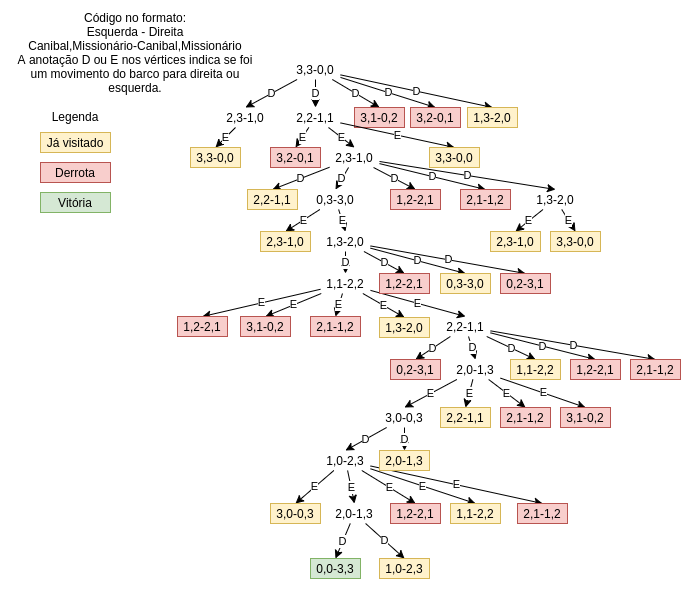

# Missionários e Canibais

Solução do problema de missionários e canibais para SCC5774 no ICMC-USP. O problema também pode ser encontrado no livro Inteligência Artificial (Russel e Norvig) 3.9.

Definição do problema:

3.9 O problema de missionários e canibais é normalmente enunciado como a seguir. Três missionários e três canibais estão em um lado de um rio, juntamente com um barco que pode levar uma ou duas pessoas. Descubra um meio de fazer todos atravessarem o rio sem deixar que um grupo de missionários de um lado fique em número menor que o número de canibais nesse mesmo lado do rio. Esse problema é famoso em IA porque foi assunto do primeiro artigo que abordou a formulação de problemas a partir de um ponto de vista analítico (Amarel, 1968).

1. a. Formule o problema precisamente, fazendo apenas as especificações necessárias para assegurar uma solução válida. Faça um diagrama do espaço de estados completo.



2. b. Implemente e resolva o problema de forma ótima, utilizando um algoritmo de busca apropriado. É uma boa ideia verificar a existência de estados repetidos?

## Requerimentos

* Python 3.6

Baixe o repositório atual e execute o comando:

```bash
make solve
```

O programa irá mostrar a sequência de passos necessárias para resolver o problema.

Os estados já visitados devem ser evitados, caso contrário a busca pode demorar mais, ou pode ficar presa em loops infinitos caso a busca em profundidade seja utilizada.


3. c. Por que você imagina que as pessoas têm dificuldades para resolver esse quebra-cabeça, considerando que o espaço de estados é tão simples?

Como cada nó pode ser expandido até 5 vezes, fica difícil manter todos os estados memória, porém se o jogador compreender que deve primeiro mover os canibais e depois ir movendo em conjunto os missionários, fica fácil de decifrar o problema, mesmo que não tenha calculado/memorizado todos os estados possíveis.
